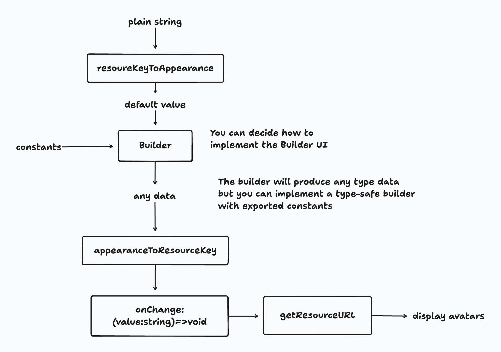

# UI

Some utility functions to help you build and display avatars  
run `pnpm dev` to view examples

You can learn how to build a builder from the stories file.

But in our case, most of the types are missing inside the component. We rely on valibot to validate the final data.

Because after trying to make it typesafe, I think it is not very meaningful. 
The benefit is mainly that you can skip the valibot validation process.

But you can definitely create a type-safe builder with the data provided in this package if you want.
